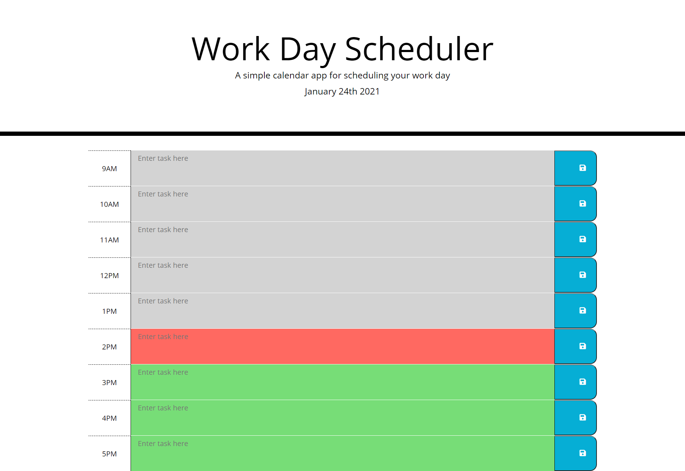

# Work Day Scheduler 

## Description
This is my Weekly Challenge #5 for my Coding Boot Camp class. We were required to create a daily planner for a busy employee. The current day must be displayed on top, time blocks for standard business hours created, color-coded blocks (to indicate past, present, and future), and text typed is saved in local storage.

[Live URL](https://dmorgan904.github.io/daily-planner/)

### Installation
1. Display time and date at top using Moment.js
2. Add save icon using Font Awesome and created timeblocks, making textarea editable.
3. Restructure timeblocks, display just date at top, and create for loop
4. Edit for loop to make color-coding work
5. Edit font colors for textarea, add ids to buttons, and create local storage.

### Usage
Work Day Scheduler can be used for employees to organzie their busy days visually on a calendar. The current hour is highlighted in red, past hours are in gray, and future hours are in green. The employee would type something in the textarea and click the save icon. When the page is refreshed, all tasks created will remain. 

  
